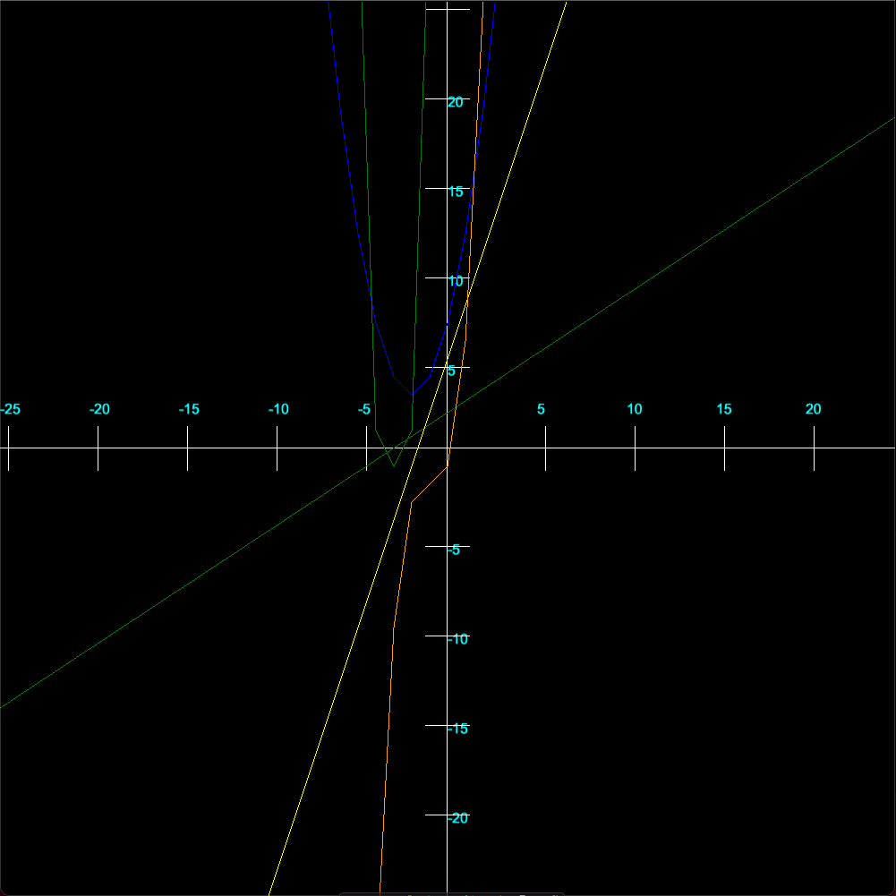

**GRAPH2D**

A simple Two-Dimensional graphing tool used to graph different line and polynomial functions.

**Dependencies**

1. [clang](https://clang.llvm.org/)
2. [Cinder](https://libcinder.org/)
3. [cmake](https://cmake.org/)

**Runtime**

Simply create a file that follows the format of the sample functions and graph away!
Zoom in and out of the graph at your pleasure.

**Sample**

